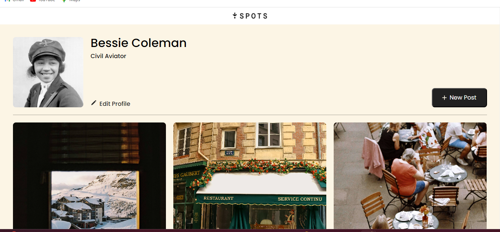

# Project 3: Spots

### Project Description

The Spots project is a site where users can upload their favourite images. Currently the projects features a user profile with the user's image, description and a grid display of photograghs. More features coming soon!

**Technologies and Techniques used**
Semantic HTML5
CSS
Flat BEM
Flexbox
Responsive Grid
Media Queries
Figma created by designer

**Figma**

- [Link to the project on Figma](https://www.figma.com/file/BBNm2bC3lj8QQMHlnqRsga/Sprint-3-Project-%E2%80%94-Spots?type=design&node-id=2%3A60&mode=design&t=afgNFybdorZO6cQo-1)

**Images**

**Github pages**
